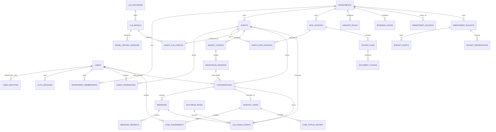

# ERD และ Data Model — Multi-Agent AI Q&A Platform

## 1. ขอบเขตการออกแบบ

Data model นี้ออกแบบสำหรับบริษัทเดียวที่มีหลายแผนก โดยถือว่า `department_id` คือขอบเขต tenant หลัก ข้อมูลที่เป็นของแผนกต้องมี `department_id` เสมอและถูกป้องกันทั้ง application layer และ PostgreSQL Row-Level Security (RLS)

MVP รองรับ:

- ผู้ใช้ภายในประมาณ 40 คนใน 8 แผนก
- Agent ที่เลือกใช้ MySQL, Excel และ PDF ได้อย่างอิสระ
- Internal chat และ public embed widget
- Human Handoff ผ่าน Inbox ของแผนก
- Token usage, ค่าใช้จ่าย USD/THB, อัตราแลกเปลี่ยน และงบรายแผนก
- Local LLM และ OpenRouter ผ่าน LLM gateway กลาง

หลักการสำคัญ:

1. UUID ใช้เป็น primary key ทุกตารางที่เปิดผ่าน API
2. เวลาเก็บเป็น `timestamptz` ใน UTC และแสดงผลด้วย timezone ของแผนก/บริษัท
3. จำนวนเงินเก็บด้วย `numeric(20,8)` ห้ามใช้ floating point
4. Token เก็บด้วย `bigint`
5. Secret ไม่เก็บ plaintext ใน PostgreSQL ให้เก็บเพียง `secret_ref` ที่ชี้ไป Vault/KMS
6. ข้อมูลสำคัญใช้ soft delete (`deleted_at`) เพื่อรักษา audit trail
7. ตารางที่มี `department_id` ต้องเปิด RLS และห้าม client ส่ง tenant context มาเป็นแหล่งความจริง

## 2. ERD ภาพรวม



ERD แสดงเฉพาะความสัมพันธ์หลัก ตาราง operational เช่น jobs, notifications และ audit logs อธิบายเพิ่มเติมด้านล่าง

## 3. Identity, Department และสิทธิ์

### `users`

| Column | Type | Constraint/หมายเหตุ |
|---|---|---|
| id | uuid | PK |
| email | citext | unique, not null |
| display_name | varchar(200) | not null |
| system_role | varchar(30) | `super_admin` หรือ `standard_user` |
| status | varchar(20) | `active`, `disabled`, `invited` |
| last_login_at | timestamptz | nullable |
| created_at, updated_at | timestamptz | not null |
| deleted_at | timestamptz | nullable |

### `user_identities`

ผู้ใช้หนึ่งคนเชื่อมได้มากกว่าหนึ่งวิธีเข้าสู่ระบบ โดย Pilot ใช้บัญชีภายในก่อน ส่วน schema เตรียมรองรับ Microsoft Entra ID ในลำดับถัดไป

| Column | Type | Constraint/หมายเหตุ |
|---|---|---|
| id | uuid | PK |
| user_id | uuid | FK users, not null |
| provider_type | varchar(30) | Pilot ใช้ `local`; `microsoft_entra` สงวนไว้สำหรับ phase ถัดไป |
| provider_tenant_id | varchar(100) | Entra tenant ID; null สำหรับ local |
| provider_subject | varchar(255) | Entra `oid`/subject หรือ normalized local username |
| email_at_link_time | citext | nullable; ใช้ audit ไม่ใช้เป็น authorization key |
| password_hash | text | nullable; Argon2id สำหรับ local เท่านั้น |
| password_changed_at | timestamptz | nullable |
| mfa_required | boolean | true สำหรับ local admin |
| status | varchar(20) | `pending_activation`, `active`, `disabled`, `locked` |
| last_login_at | timestamptz | nullable |
| created_at, updated_at | timestamptz | not null |

Unique constraint: `(provider_type, provider_tenant_id, provider_subject)` โดยใช้ null-safe uniqueness ตาม PostgreSQL version

ห้าม auto-link Microsoft identity กับ local account จาก email เพียงอย่างเดียว การ link/unlink ต้องผ่านผู้ใช้ที่ยืนยันตัวตนแล้วหรือ Super Admin และบันทึก audit log

Pilot ไม่มี public self-registration บัญชีถูกสร้าง/เชิญโดย Super Admin หรือ Department Admin เท่านั้น และตั้งรหัสผ่านครั้งแรกผ่าน activation token แบบใช้ครั้งเดียว

### `auth_sessions`

เก็บ session ของเว็บแบบ revocable โดยเก็บ refresh/session token เป็น hash เท่านั้น

Columns หลัก: `id`, `user_id`, `identity_id`, `token_hash`, `ip_hash`, `user_agent`, `expires_at`, `last_seen_at`, `revoked_at`, `created_at`

### `departments`

| Column | Type | Constraint/หมายเหตุ |
|---|---|---|
| id | uuid | PK |
| code | varchar(50) | unique, not null |
| name | varchar(200) | not null |
| timezone | varchar(64) | default `Asia/Bangkok` |
| status | varchar(20) | `active`, `suspended`, `disabled` |
| retention_days | integer | default 90 |
| created_at, updated_at | timestamptz | not null |
| deleted_at | timestamptz | nullable |

### `department_memberships`

| Column | Type | Constraint/หมายเหตุ |
|---|---|---|
| id | uuid | PK |
| department_id | uuid | FK departments, not null |
| user_id | uuid | FK users, not null |
| role | varchar(30) | `owner`, `admin`, `member`, `viewer` |
| status | varchar(20) | `active`, `invited`, `disabled` |
| created_at, updated_at | timestamptz | not null |

Unique constraint: `(department_id, user_id)`

### `agent_permissions`

ใช้จำกัดสมาชิกให้เข้าถึง Agent บางตัว หากไม่มี record ให้ใช้สิทธิ์ตาม membership และ policy ของแผนก

| Column | Type | Constraint/หมายเหตุ |
|---|---|---|
| id | uuid | PK |
| department_id | uuid | FK, not null |
| agent_id | uuid | FK agents, not null |
| user_id | uuid | FK users, not null |
| permission | varchar(20) | `owner`, `editor`, `operator`, `viewer` |
| created_at | timestamptz | not null |

Unique constraint: `(agent_id, user_id)`

MVP กำหนดให้สมาชิกทุกคนที่มีสิทธิ์เข้าถึง Agent สามารถรับและตอบ Handoff case ของ Agent นั้นได้

## 4. Agent, LLM และ Data Source

### `agents`

| Column | Type | Constraint/หมายเหตุ |
|---|---|---|
| id | uuid | PK |
| department_id | uuid | FK, not null, RLS |
| name | varchar(200) | not null |
| description | text | nullable |
| system_prompt | text | not null |
| status | varchar(20) | `draft`, `indexing`, `active`, `paused`, `disabled`, `error` |
| internal_chat_enabled | boolean | default true |
| public_widget_enabled | boolean | default false |
| handoff_enabled | boolean | default true |
| require_citations | boolean | default true |
| created_by, updated_by | uuid | FK users |
| created_at, updated_at | timestamptz | not null |
| deleted_at | timestamptz | nullable |

### `agent_prompt_versions`

เก็บประวัติ prompt เพื่อ rollback และเชื่อมผล evaluation กับ prompt ที่ใช้จริง

| Column | Type | Constraint/หมายเหตุ |
|---|---|---|
| id | uuid | PK |
| department_id | uuid | FK, not null |
| agent_id | uuid | FK, not null |
| version | integer | not null |
| system_prompt | text | not null |
| change_note | text | nullable |
| created_by | uuid | FK users |
| created_at | timestamptz | not null |

Unique constraint: `(agent_id, version)`

### `llm_providers`

| Column | Type | Constraint/หมายเหตุ |
|---|---|---|
| id | uuid | PK |
| provider_type | varchar(30) | `openrouter`, `ollama`, `vllm` |
| name | varchar(100) | not null |
| base_url | text | not null |
| secret_ref | text | nullable; OpenRouter key หรือ auth token |
| status | varchar(20) | `active`, `disabled`, `unhealthy` |
| created_at, updated_at | timestamptz | not null |

### `llm_models`

| Column | Type | Constraint/หมายเหตุ |
|---|---|---|
| id | uuid | PK |
| provider_id | uuid | FK llm_providers |
| model_key | varchar(200) | identifier ที่ส่งให้ provider |
| display_name | varchar(200) | not null |
| context_window | integer | nullable |
| supports_tools | boolean | default false |
| supports_streaming | boolean | default true |
| status | varchar(20) | `active`, `disabled` |

Unique constraint: `(provider_id, model_key)`

### `agent_llm_configs`

| Column | Type | Constraint/หมายเหตุ |
|---|---|---|
| id | uuid | PK |
| department_id | uuid | FK, not null |
| agent_id | uuid | FK, unique, not null |
| model_id | uuid | FK llm_models |
| temperature | numeric(4,3) | default 0.2 |
| max_output_tokens | integer | not null |
| timeout_seconds | integer | not null |
| config_json | jsonb | provider-specific options ที่ไม่ใช่ secret |
| updated_by | uuid | FK users |
| updated_at | timestamptz | not null |

### `data_sources`

| Column | Type | Constraint/หมายเหตุ |
|---|---|---|
| id | uuid | PK |
| department_id | uuid | FK, not null, RLS |
| name | varchar(200) | not null |
| source_type | varchar(20) | `mysql`, `excel`, `pdf` |
| status | varchar(20) | `draft`, `validating`, `ready`, `error`, `disabled` |
| secret_ref | text | nullable; ใช้กับ MySQL เท่านั้น |
| connection_config | jsonb | host alias, port, database; ห้ามมี password |
| allowed_schema | jsonb | allowed tables/columns หรือ file parsing policy |
| created_by, updated_by | uuid | FK users |
| created_at, updated_at | timestamptz | not null |
| deleted_at | timestamptz | nullable |

สำหรับ MySQL ต้องใช้ read-only account, validate ด้วย SQL AST, บังคับ limit/timeout และแนะนำให้เชื่อม read replica

### `agent_data_sources`

| Column | Type | Constraint/หมายเหตุ |
|---|---|---|
| id | uuid | PK |
| department_id | uuid | FK, not null |
| agent_id | uuid | FK, not null |
| data_source_id | uuid | FK, not null |
| access_scope | varchar(20) | `internal_only` หรือ `public_allowed` |
| priority | integer | default 100 |
| enabled | boolean | default true |
| created_at | timestamptz | not null |

Unique constraint: `(agent_id, data_source_id)`

ห้าม public widget ใช้ source ที่เป็น `internal_only` แม้ Agent เดียวกันจะใช้ source นั้นใน internal chat ได้

### `source_files`

| Column | Type | Constraint/หมายเหตุ |
|---|---|---|
| id | uuid | PK |
| department_id | uuid | FK, not null |
| data_source_id | uuid | FK, not null; ใช้กับ Excel/PDF |
| object_key | text | path ใน S3/MinIO |
| original_name | text | not null |
| mime_type | varchar(100) | allowlist เท่านั้น |
| size_bytes | bigint | not null |
| sha256 | char(64) | not null |
| status | varchar(20) | `uploaded`, `scanning`, `processing`, `ready`, `failed`, `quarantined` |
| version | integer | not null |
| processing_error | text | sanitized, nullable |
| uploaded_by | uuid | FK users |
| created_at, indexed_at | timestamptz | nullableตามสถานะ |

### `document_chunks`

| Column | Type | Constraint/หมายเหตุ |
|---|---|---|
| id | uuid | PK |
| department_id | uuid | FK, not null, RLS |
| agent_id | uuid | FK, not null; duplicate index per agent เพื่อ isolation ชัดเจน |
| source_file_id | uuid | FK, not null |
| chunk_index | integer | not null |
| content | text | not null |
| content_tsv | tsvector | optional hybrid search |
| embedding | vector | dimension ตาม embedding model |
| metadata | jsonb | page, sheet, row range, heading |
| embedding_model | varchar(200) | not null |
| created_at | timestamptz | not null |

Index และ query ต้องมี `(department_id, agent_id)` เป็น filter บังคับก่อน vector search

## 5. Widget, Conversation และ Message

### `widget_configs`

| Column | Type | Constraint/หมายเหตุ |
|---|---|---|
| id | uuid | PK |
| department_id | uuid | FK, not null |
| agent_id | uuid | FK, not null |
| public_key | varchar(80) | unique, random identifier; ไม่ใช่ secret |
| status | varchar(20) | `draft`, `active`, `paused`, `revoked` |
| allowed_domains | text[] | not null |
| rate_limit_per_minute | integer | not null |
| welcome_message | text | nullable |
| privacy_notice | text | not null |
| theme_config | jsonb | สี/ตำแหน่ง/branding |
| created_at, updated_at | timestamptz | not null |

Public client ใช้ `public_key` เพื่อขอ short-lived signed session token การตรวจ CORS/domain เป็นเพียงหนึ่งชั้นและต้องใช้ rate limit/quota ร่วมด้วย

### `anonymous_sessions`

| Column | Type | Constraint/หมายเหตุ |
|---|---|---|
| id | uuid | PK |
| department_id | uuid | FK, not null |
| widget_config_id | uuid | FK, not null |
| session_token_hash | char(64) | unique; เก็บ hash เท่านั้น |
| display_name | varchar(200) | optional |
| email_encrypted | text | optional |
| phone_encrypted | text | optional |
| consent_at | timestamptz | nullable |
| last_seen_at | timestamptz | not null |
| expires_at | timestamptz | not null |
| created_at | timestamptz | not null |

### `conversations`

| Column | Type | Constraint/หมายเหตุ |
|---|---|---|
| id | uuid | PK |
| department_id | uuid | FK, not null, RLS |
| agent_id | uuid | FK, not null |
| channel | varchar(20) | `internal_chat`, `public_widget` |
| internal_user_id | uuid | nullable FK users |
| anonymous_session_id | uuid | nullable FK anonymous_sessions |
| status | varchar(20) | `active`, `handoff`, `resolved`, `closed` |
| title | varchar(300) | nullable |
| last_message_at | timestamptz | not null |
| created_at, updated_at | timestamptz | not null |
| closed_at | timestamptz | nullable |

Check constraint: internal channel ต้องมี `internal_user_id`; public channel ต้องมี `anonymous_session_id`

### `messages`

| Column | Type | Constraint/หมายเหตุ |
|---|---|---|
| id | uuid | PK |
| department_id | uuid | FK, not null, RLS |
| conversation_id | uuid | FK, not null |
| sender_type | varchar(20) | `user`, `ai`, `staff`, `system` |
| sender_user_id | uuid | nullable FK users |
| client_message_id | uuid | idempotency จาก client, nullable |
| content | text | not null |
| content_format | varchar(20) | MVP = `plain_text` หรือ `markdown_safe` |
| ai_generated | boolean | not null |
| draft_approved_by | uuid | nullable FK users |
| reply_to_message_id | uuid | nullable self FK |
| metadata | jsonb | citations, tool status; ห้ามมี secret |
| created_at | timestamptz | not null |
| deleted_at | timestamptz | nullable |

Unique constraint: `(conversation_id, client_message_id)` เมื่อ client_message_id ไม่เป็น null

MVP ไม่อนุญาต file attachment

### `message_feedback`

| Column | Type | Constraint/หมายเหตุ |
|---|---|---|
| id | uuid | PK |
| department_id | uuid | FK, not null |
| message_id | uuid | FK, not null |
| rating | varchar(20) | `helpful`, `not_helpful` |
| reason | varchar(100) | nullable |
| comment | text | nullable |
| created_by_user_id | uuid | nullable |
| anonymous_session_id | uuid | nullable |
| created_at | timestamptz | not null |

## 6. Human Handoff

### `handoff_cases`

| Column | Type | Constraint/หมายเหตุ |
|---|---|---|
| id | uuid | PK |
| department_id | uuid | FK, not null, RLS |
| agent_id | uuid | FK, not null |
| conversation_id | uuid | FK, unique, not null |
| previous_case_id | uuid | nullable self FK |
| status | varchar(30) | ดู state machine ด้านล่าง |
| priority | varchar(20) | `low`, `normal`, `high`, `urgent` |
| trigger_type | varchar(40) | `low_confidence`, `no_source`, `tool_error`, `negative_feedback`, `repeat_failure`, `admin_rule` |
| trigger_detail | jsonb | rule/version/signal; ไม่เก็บ chain-of-thought |
| assigned_user_id | uuid | nullable FK users; denormalized current owner |
| first_response_due_at | timestamptz | nullable |
| resolution_due_at | timestamptz | nullable |
| first_responded_at | timestamptz | nullable |
| resolved_at, closed_at | timestamptz | nullable |
| reopen_until | timestamptz | nullable |
| created_at, updated_at | timestamptz | not null |
| version | integer | optimistic locking |

สถานะ:

```text
AI_ACTIVE → WAITING_FOR_AGENT → ASSIGNED → AGENT_ACTIVE
AGENT_ACTIVE ↔ WAITING_FOR_CUSTOMER
AGENT_ACTIVE → AI_ACTIVE
AGENT_ACTIVE → RESOLVED → CLOSED
CLOSED → REOPENED (ภายใน 24 ชั่วโมง) → WAITING_FOR_AGENT
```

การกดรับเคสต้องทำด้วย transaction และ `UPDATE ... WHERE assigned_user_id IS NULL` หรือ row lock เพื่อให้มีผู้รับได้เพียงคนเดียว

### `case_assignments`

| Column | Type | Constraint/หมายเหตุ |
|---|---|---|
| id | uuid | PK |
| department_id | uuid | FK, not null |
| case_id | uuid | FK, not null |
| user_id | uuid | FK, not null |
| assigned_by | uuid | nullable FK users; null เมื่อกดรับเอง |
| assignment_type | varchar(20) | MVP = `self_claim` หรือ `admin_assign` |
| assigned_at | timestamptz | not null |
| released_at | timestamptz | nullable |

### `case_status_history`

| Column | Type | Constraint/หมายเหตุ |
|---|---|---|
| id | uuid | PK |
| department_id | uuid | FK, not null |
| case_id | uuid | FK, not null |
| from_status, to_status | varchar(30) | not null |
| changed_by_type | varchar(20) | `system`, `user`, `ai_rule` |
| changed_by_user_id | uuid | nullable |
| reason | text | nullable |
| created_at | timestamptz | not null |

### `case_sla_events`

เก็บเหตุการณ์ SLA แยกจาก status history เพราะการเตือนหรือ breach อาจไม่ทำให้สถานะเคสเปลี่ยน

| Column | Type | Constraint/หมายเหตุ |
|---|---|---|
| id | uuid | PK |
| department_id | uuid | FK, not null |
| case_id | uuid | FK, not null |
| event_type | varchar(30) | `due_calculated`, `warning`, `breached`, `recalculated`, `cancelled` |
| target_type | varchar(30) | `first_response`, `resolution` |
| due_at | timestamptz | nullable |
| policy_snapshot | jsonb | SLA และปฏิทินที่ใช้คำนวณ |
| created_at | timestamptz | not null |

### `handoff_rules`

| Column | Type | Constraint/หมายเหตุ |
|---|---|---|
| id | uuid | PK |
| department_id | uuid | FK, not null |
| agent_id | uuid | nullable; null = default ของแผนก |
| rule_type | varchar(40) | `no_source`, `tool_error`, `negative_feedback`, `repeat_failure`, `keyword`, `category` |
| config | jsonb | threshold/keywords/category |
| enabled | boolean | default true |
| priority | integer | ลำดับประเมิน |
| created_by, updated_by | uuid | FK users |
| created_at, updated_at | timestamptz | not null |

### `business_hours`

| Column | Type | Constraint/หมายเหตุ |
|---|---|---|
| id | uuid | PK |
| department_id | uuid | FK, not null |
| day_of_week | smallint | 1-7 |
| start_time, end_time | time | not null |
| is_open | boolean | not null |

### `department_holidays`

| Column | Type | Constraint/หมายเหตุ |
|---|---|---|
| id | uuid | PK |
| department_id | uuid | FK, not null |
| holiday_date | date | not null |
| name | varchar(200) | not null |
| is_closed | boolean | default true |
| override_start_time, override_end_time | time | nullable |

### `department_sla_policies`

| Column | Type | Constraint/หมายเหตุ |
|---|---|---|
| id | uuid | PK |
| department_id | uuid | FK, not null |
| priority | varchar(20) | low/normal/high/urgent |
| first_response_minutes | integer | not null |
| resolution_minutes | integer | nullable |
| count_business_hours_only | boolean | default true |
| notify_before_minutes | integer | nullable |
| enabled | boolean | default true |

Unique constraint: `(department_id, priority)`

## 7. Token, Pricing, Exchange Rate และ Budget

### `model_pricing_versions`

| Column | Type | Constraint/หมายเหตุ |
|---|---|---|
| id | uuid | PK |
| model_id | uuid | FK llm_models |
| currency | char(3) | ปกติ `USD` |
| input_per_million | numeric(20,8) | not null |
| output_per_million | numeric(20,8) | not null |
| cached_input_per_million | numeric(20,8) | nullable |
| effective_from | timestamptz | not null |
| effective_to | timestamptz | nullable |
| source | text | provider/manual |

ช่วง effective ของ model เดียวกันต้องไม่ overlap

### `exchange_rates`

| Column | Type | Constraint/หมายเหตุ |
|---|---|---|
| id | uuid | PK |
| base_currency | char(3) | `USD` |
| quote_currency | char(3) | `THB` |
| rate | numeric(20,8) | not null |
| source | varchar(100) | not null |
| effective_at | timestamptz | not null |
| fetched_at | timestamptz | not null |
| status | varchar(20) | `live`, `stale`, `manual_fallback` |

### `llm_usage_events`

หนึ่ง record ต่อหนึ่ง provider call ไม่ใช่หนึ่ง record ต่อข้อความ

| Column | Type | Constraint/หมายเหตุ |
|---|---|---|
| id | uuid | PK |
| department_id | uuid | FK, not null, RLS |
| agent_id | uuid | FK, not null |
| conversation_id | uuid | nullable FK |
| message_id | uuid | nullable FK; ข้อความที่ trigger call |
| request_trace_id | uuid | รวมหลาย call ของคำถามเดียวกัน |
| parent_event_id | uuid | nullable self FK |
| usage_type | varchar(40) | `coordinator`, `sql_agent`, `rag_agent`, `excel_agent`, `answer_synthesis`, `handoff_classification`, `agent_reply_draft`, `conversation_summary` |
| provider_id, model_id | uuid | FK |
| pricing_version_id | uuid | nullableสำหรับ local |
| exchange_rate_id | uuid | nullable |
| input_tokens | bigint | not null |
| output_tokens | bigint | not null |
| cached_input_tokens | bigint | default 0 |
| provider_cost_usd | numeric(20,8) | not null |
| infrastructure_cost_usd | numeric(20,8) | default 0 |
| display_cost_usd | numeric(20,8) | not null |
| display_cost_thb | numeric(20,8) | not null |
| exchange_rate_snapshot | numeric(20,8) | not null |
| pricing_snapshot | jsonb | ราคาที่ใช้คำนวณ ณ ตอนนั้น |
| latency_ms | integer | nullable |
| status | varchar(20) | `succeeded`, `failed`, `cancelled` |
| provider_request_id | varchar(255) | nullable |
| created_at | timestamptz | not null |

ห้ามแก้ไข usage event หลังสร้าง ยกเว้น reconciliation field ที่มี audit log

### `department_budgets`

| Column | Type | Constraint/หมายเหตุ |
|---|---|---|
| id | uuid | PK |
| department_id | uuid | FK, not null |
| currency | char(3) | `USD` หรือ `THB` |
| limit_amount | numeric(20,8) | not null |
| period_type | varchar(20) | MVP = `monthly` |
| period_start_day | smallint | default 1 |
| action_on_exceed | varchar(30) | `notify_only`, `pause_public_widget`, `pause_all_llm` |
| warning_thresholds | numeric[] | default `{70,90,100}` |
| enabled | boolean | not null |
| created_at, updated_at | timestamptz | not null |

MVP กำหนดงบระดับแผนก ราย Agent ใช้เพื่อ breakdown ใน dashboard แต่ยังไม่บังคับวงเงินแยก

### `budget_alerts`

| Column | Type | Constraint/หมายเหตุ |
|---|---|---|
| id | uuid | PK |
| department_id | uuid | FK, not null |
| budget_id | uuid | FK, not null |
| period_key | varchar(20) | เช่น `2026-08` |
| threshold_percent | numeric(6,2) | not null |
| spent_amount | numeric(20,8) | snapshot |
| action_taken | varchar(30) | notify/pause/override |
| triggered_at | timestamptz | not null |
| acknowledged_by | uuid | nullable FK users |

Unique constraint: `(budget_id, period_key, threshold_percent)` ป้องกันแจ้งซ้ำ

### `budget_reservations`

ใช้กันวงเงินแบบ atomic ก่อนเรียก LLM เพื่อไม่ให้ concurrent requests ใช้งบเกิน limit

| Column | Type | Constraint/หมายเหตุ |
|---|---|---|
| id | uuid | PK |
| department_id | uuid | FK, not null |
| budget_id | uuid | FK, not null |
| request_trace_id | uuid | not null |
| estimated_amount | numeric(20,8) | not null ใน currency ของ budget |
| settled_amount | numeric(20,8) | nullable |
| currency | char(3) | USD/THB |
| status | varchar(20) | `reserved`, `settled`, `released`, `expired` |
| expires_at | timestamptz | not null |
| created_at, settled_at | timestamptz | nullableตามสถานะ |

Unique constraint: `(budget_id, request_trace_id)` และการ reserve/settle ต้องทำใน transaction เดียวกับ ledger counter ของรอบงบประมาณ

### `usage_daily_rollups`

ตารางสรุปเพื่อ dashboard ไม่ใช่ source of truth

Unique key: `(department_id, agent_id, usage_date, channel, model_id, usage_type)` พร้อมยอด token/cost/request count

### `local_cost_settings`

| Column | Type | Constraint/หมายเหตุ |
|---|---|---|
| id | uuid | PK |
| mode | varchar(40) | `zero_provider_cost`, `estimated_infrastructure_cost` |
| hourly_cost_usd | numeric(20,8) | nullable |
| allocation_method | varchar(30) | `gpu_seconds`, `request`, `token` |
| effective_from | timestamptz | not null |
| effective_to | timestamptz | nullable |
| updated_by | uuid | FK users |

## 8. Operational Tables

### `agent_runs`

เก็บ lifecycle ของคำถามหนึ่งครั้งสำหรับ queue, cancellation และ SSE reconnect โดยไม่เก็บ chain-of-thought

Columns หลัก: `id`, `department_id`, `agent_id`, `conversation_id`, `trigger_message_id`, `request_trace_id`, `status`, `current_stage`, `error_code`, `started_at`, `completed_at`, `cancelled_at`, `created_at`

สถานะ: `queued`, `running`, `completed`, `failed`, `cancelled`, `handoff_created`

### `message_drafts`

เก็บ AI draft สำหรับเจ้าหน้าที่ โดย draft จะไม่ปรากฏแก่ผู้ใช้ภายนอกจนกว่าจะ approve และสร้าง `messages` record

Columns หลัก: `id`, `department_id`, `case_id`, `content`, `source_message_ids`, `usage_event_id`, `status`, `created_by_user_id`, `approved_by_user_id`, `created_at`, `approved_at`, `discarded_at`

สถานะ: `generated`, `approved`, `discarded`, `expired`

### `upload_sessions`

เก็บ presigned upload lifecycle ก่อนสร้าง `source_files`

Columns หลัก: `id`, `department_id`, `data_source_id`, `object_key`, `expected_sha256`, `expected_size_bytes`, `status`, `expires_at`, `completed_at`, `created_by`, `created_at`

### `background_jobs`

งาน index PDF/Excel, sync exchange rate, usage rollup และ retention cleanup

Columns หลัก: `id`, `department_id` nullable, `job_type`, `resource_type`, `resource_id`, `status`, `progress_percent`, `attempt`, `error_code`, `error_message`, `started_at`, `finished_at`, `created_at`

### `notifications`

Columns หลัก: `id`, `department_id`, `user_id`, `type`, `title`, `body`, `resource_type`, `resource_id`, `channel`, `status`, `read_at`, `sent_at`, `created_at`

### `notification_preferences`

กำหนด web/email แยกตาม event เช่น new case, message, SLA warning, SLA breach และ budget alert

### `audit_logs`

| Column | Type | Constraint/หมายเหตุ |
|---|---|---|
| id | uuid | PK |
| department_id | uuid | nullable; null สำหรับ system-level event |
| actor_user_id | uuid | nullable |
| actor_type | varchar(20) | user/system/service |
| action | varchar(100) | not null |
| resource_type | varchar(80) | not null |
| resource_id | uuid | nullable |
| request_id | uuid | not null |
| ip_hash | char(64) | nullable |
| user_agent | text | nullableและ sanitized |
| before_data, after_data | jsonb | redact secret/PII |
| created_at | timestamptz | append-only |

## 9. RLS และ Integrity Rules

### Tenant context

Backend กำหนด tenant context หลังตรวจ token และ membership:

```sql
SET LOCAL app.user_id = '<authenticated-user-uuid>';
SET LOCAL app.department_id = '<authorized-department-uuid>';
SET LOCAL app.system_role = '<system-role>';
```

ตัวอย่าง policy:

```sql
ALTER TABLE agents ENABLE ROW LEVEL SECURITY;

CREATE POLICY agents_department_isolation ON agents
USING (
  department_id = current_setting('app.department_id', true)::uuid
  OR current_setting('app.system_role', true) = 'super_admin'
)
WITH CHECK (
  department_id = current_setting('app.department_id', true)::uuid
  OR current_setting('app.system_role', true) = 'super_admin'
);
```

Service account ของ application ต้องไม่เป็น table owner และต้องไม่ใช้ `BYPASSRLS` ใน request path ปกติ งาน system ข้าม tenant ต้องใช้ service role แยกและ audit ทุกครั้ง

### Cross-table tenant integrity

Foreign key ปกติไม่ยืนยันว่า record ทั้งสองอยู่ department เดียวกัน จึงต้องใช้ composite unique/foreign key หรือ trigger สำหรับความสัมพันธ์สำคัญ เช่น:

- `(department_id, agent_id)`
- `(department_id, conversation_id)`
- `(department_id, data_source_id)`
- `(department_id, case_id)`

### Delete policy

- Department/Agent/Data source: soft delete และ revoke access ทันที
- Conversation/Message: retention job anonymize หรือลบตาม policy 90 วัน
- Usage/Audit: แยก retention ตามข้อกำหนดบัญชีและ security ห้าม cascade delete ตาม conversation
- Source file: ลบ object และ chunks ผ่าน background job ที่ retry ได้

## 10. Index สำคัญ

- `agents(department_id, status)`
- `data_sources(department_id, source_type, status)`
- `conversations(department_id, agent_id, channel, last_message_at desc)`
- `messages(department_id, conversation_id, created_at)`
- `handoff_cases(department_id, status, priority, created_at)`
- `handoff_cases(department_id, assigned_user_id, status)`
- `llm_usage_events(department_id, created_at)`
- `llm_usage_events(request_trace_id)`
- `usage_daily_rollups(department_id, usage_date)`
- Vector index ของ `document_chunks.embedding` แยก/partition ตามขนาดจริง พร้อม mandatory department/agent filter

## 11. Decisions ที่ล็อกสำหรับ MVP

- บริษัทเดียว หลายแผนก; department เป็น tenant boundary
- Source ทุกชนิดเปิด/ปิดต่อ Agent ได้ และกำหนด `internal_only/public_allowed`
- Public widget ต้องมี internal Inbox สำหรับ Human Handoff
- สมาชิกทุกคนที่เข้าถึง Agent สามารถกดรับเคสได้
- ไม่มี file attachment ใน chat
- ปิดเคสแล้วเปิดกลับได้ภายใน 24 ชั่วโมง
- Conversation retention เริ่มต้น 90 วัน
- งบประมาณกำหนดระดับแผนก
- แสดงค่าใช้จ่ายทั้ง USD/THB และเก็บ snapshot อัตราแลกเปลี่ยน
- Local cost เลือก 0 หรือ estimated infrastructure cost ได้
- Pilot ใช้บัญชีภายในเป็นช่องทางเข้าสู่ระบบหลักและช่องทางเดียวที่เปิดใช้งาน
- Data model เตรียมรองรับ Microsoft Entra ID/Microsoft 365 ใน phase ถัดไป
- เมื่อเพิ่ม Microsoft identity ต้องผูกด้วย tenant ID + immutable object/subject ID ไม่ใช้ email เป็น security boundary
