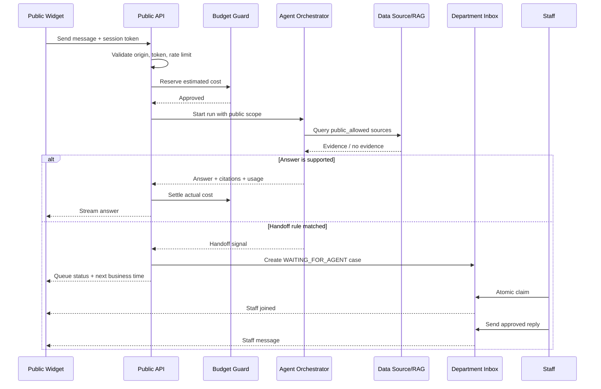
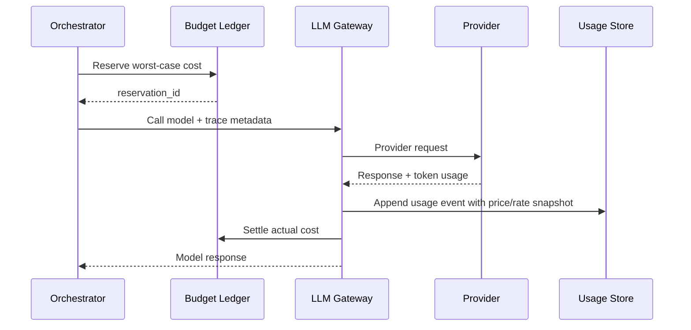

# REST API Contract — Multi-Agent AI Q&A Platform

## 1. API Conventions

### Base URL และ versioning

```text
/api/v1
```

- JSON ใช้ `snake_case`
- ID เป็น UUID
- เวลาเป็น ISO 8601 UTC เช่น `2026-08-12T08:30:00Z`
- เงินส่งเป็น string เพื่อไม่เสีย precision เช่น `"12.45000000"`
- Breaking change เพิ่ม major path version; additive field ไม่ถือเป็น breaking change
- Browser ภายในใช้ secure HttpOnly session cookie ที่ backend ออกหลัง local login; Microsoft OIDC และ service/API Bearer token เป็น phase ถัดไป
- Public widget API ใช้ short-lived widget session token แยกจาก internal token

### Tenant resolution

Client ห้ามกำหนด `department_id` ใน write payload เป็นแหล่งความจริง

- Internal request: backend resolve department จาก token + membership และ route path
- Super Admin: ระบุ department ผ่าน `/departments/{department_id}` และ audit ทุก cross-department action
- Public request: resolve department/agent จาก signed widget session token
- Repository/database transaction ต้องตั้ง RLS context ทุกครั้ง

### Standard response

```json
{
  "data": {},
  "meta": {
    "request_id": "b8ac7b33-7adc-45d4-9a19-cb729a60cf0c"
  }
}
```

List response:

```json
{
  "data": [],
  "meta": {
    "request_id": "b8ac7b33-7adc-45d4-9a19-cb729a60cf0c",
    "next_cursor": "opaque-cursor-or-null",
    "has_more": false
  }
}
```

### Error format

ใช้ `application/problem+json`:

```json
{
  "type": "https://agentdesk.local/problems/budget-exceeded",
  "title": "Department budget exceeded",
  "status": 402,
  "code": "BUDGET_EXCEEDED",
  "detail": "LLM usage is paused for this department.",
  "request_id": "b8ac7b33-7adc-45d4-9a19-cb729a60cf0c",
  "errors": []
}
```

Error code หลัก:

- `AUTH_REQUIRED`, `TOKEN_EXPIRED`, `FORBIDDEN`
- `TENANT_CONTEXT_REQUIRED`, `RESOURCE_NOT_FOUND`
- `VALIDATION_ERROR`, `VERSION_CONFLICT`, `IDEMPOTENCY_CONFLICT`
- `AGENT_NOT_READY`, `DATA_SOURCE_NOT_READY`
- `BUDGET_EXCEEDED`, `RATE_LIMITED`
- `CASE_ALREADY_ASSIGNED`, `INVALID_CASE_TRANSITION`
- `LLM_PROVIDER_UNAVAILABLE`, `TOOL_EXECUTION_FAILED`

หมายเหตุ: resource ต่างแผนกตอบ `404` แทน `403` สำหรับผู้ใช้ทั่วไปเพื่อลดการเปิดเผยว่าทรัพยากรมีอยู่จริง

### Idempotency และ optimistic locking

- Endpoint สร้าง resource และส่งข้อความรองรับ `Idempotency-Key`
- Client ส่ง `client_message_id` สำหรับข้อความเพื่อกันส่งซ้ำ
- Resource ที่มี concurrent update เช่น Agent และ Handoff case ใช้ `version`
- Update ส่ง `If-Match: "<version>"`; ไม่ตรงตอบ `409 VERSION_CONFLICT`

### Pagination/filtering

- Cursor pagination: `?limit=50&cursor=<opaque>`
- จำกัด `limit` สูงสุด 100
- Date filter ใช้ `from`/`to`
- Sort ใช้ allowlist เท่านั้น ห้ามส่ง raw SQL field

## 2. Authentication และ Current Context

Pilot/MVP แรกใช้บัญชีภายในเพียงช่องทางเดียว เก็บรหัสผ่านด้วย Argon2id และสร้าง application session ผ่าน secure HttpOnly cookie

Microsoft 365 ผ่าน Microsoft Entra ID แบบ single-tenant OIDC Authorization Code Flow + PKCE จะพัฒนาในลำดับถัดไป โดยใช้ `user_identities` link เข้ากับ user เดิม ไม่สร้าง authorization จาก email โดยอัตโนมัติ

| Method | Endpoint | สิทธิ์ | หน้าที่ |
|---|---|---|---|
| POST | `/auth/local/login` | Public | local login พร้อม rate limit |
| POST | `/auth/local/activate` | Public | ตั้งรหัสผ่านครั้งแรกด้วย single-use activation token |
| POST | `/auth/refresh` | Authenticated | rotate refresh token |
| POST | `/auth/logout` | Authenticated | revoke session |
| POST | `/auth/local/forgot-password` | Public | ส่ง reset link โดยไม่เปิดเผยว่ามีบัญชีหรือไม่ |
| POST | `/auth/local/reset-password` | Public | ใช้ single-use reset token |
| GET | `/me` | Authenticated | profile, system role, memberships |
| GET | `/me/agents` | Authenticated | Agent ที่ผู้ใช้เข้าถึงได้ |
| GET | `/me/notifications` | Authenticated | notification inbox |
| PATCH | `/me/notifications/{id}` | Authenticated | mark read |
| GET | `/me/notification-preferences` | Authenticated | web/email preferences |
| PUT | `/me/notification-preferences` | Authenticated | update preferences |

ตัวอย่าง `/me`:

```json
{
  "data": {
    "id": "a2641cf7-3644-40cc-893f-555450565ac2",
    "email": "user@company.co.th",
    "display_name": "พิมพ์วิภา สายชล",
    "system_role": "standard_user",
    "memberships": [
      {
        "department_id": "702ece75-67a7-49dc-bbce-7248bc8fd53f",
        "department_name": "ฝ่ายขาย",
        "role": "admin"
      }
    ]
  }
}
```

Local account security defaults:

- Argon2id parameter ปรับตาม benchmark ให้การ verify ใช้เวลาประมาณ 100-250 ms บน production server
- รหัสผ่านอย่างน้อย 12 ตัวอักษรและตรวจ breached/common password
- Local Super Admin บังคับ MFA; ผู้ใช้ทั่วไปเตรียม schema ไว้เปิด MFA ภายหลัง
- Login rate limit ต่อ IP และ username hash พร้อม progressive delay/temporary lock
- มี local Super Admin ไม่เกิน 2 บัญชีสำหรับ Pilot เก็บ recovery credential ใน password vault และทดสอบตามรอบ
- ไม่มี public sign-up; Super Admin คนแรกสร้างผ่าน one-time bootstrap command บน server ส่วนบัญชีอื่นสร้างจาก invitation flow
- Activation/reset token เก็บเฉพาะ hash, ใช้ได้ครั้งเดียวและหมดอายุภายในเวลาที่กำหนด
- Cookie ใช้ `Secure`, `HttpOnly`, `SameSite=Lax/Strict` ตาม flow และป้องกัน CSRF สำหรับ state-changing request

## 3. Super Admin และ Department Management

| Method | Endpoint | สิทธิ์ | หน้าที่ |
|---|---|---|---|
| GET | `/system/overview` | Super Admin | ภาพรวมบริษัท |
| GET | `/departments` | Super Admin | รายการแผนก |
| POST | `/departments` | Super Admin | สร้างแผนก |
| GET | `/departments/{department_id}` | Super Admin / Member | รายละเอียดตามสิทธิ์ |
| PATCH | `/departments/{department_id}` | Super Admin / Dept Admin | แก้ข้อมูลที่อนุญาต |
| POST | `/departments/{department_id}/suspend` | Super Admin | kill switch แผนก |
| POST | `/departments/{department_id}/resume` | Super Admin | เปิดแผนกกลับ |
| GET | `/departments/{department_id}/members` | Dept Admin | รายการสมาชิก |
| POST | `/departments/{department_id}/members` | Dept Admin | เชิญ/เพิ่มสมาชิก |
| PATCH | `/departments/{department_id}/members/{user_id}` | Dept Admin | เปลี่ยน role/status |
| DELETE | `/departments/{department_id}/members/{user_id}` | Dept Admin | ยกเลิกสมาชิก |

ตัวอย่างสร้างแผนก:

```json
{
  "code": "sales",
  "name": "ฝ่ายขาย",
  "timezone": "Asia/Bangkok",
  "retention_days": 90,
  "initial_admin": {
    "email": "sales-admin@company.co.th",
    "display_name": "ผู้ดูแลฝ่ายขาย"
  }
}
```

## 4. Agent Management

| Method | Endpoint | สิทธิ์ | หน้าที่ |
|---|---|---|---|
| GET | `/departments/{department_id}/agents` | Department member | รายการตาม permission |
| POST | `/departments/{department_id}/agents` | Dept Admin/Editor | สร้าง draft Agent |
| GET | `/agents/{agent_id}` | Agent viewer+ | รายละเอียด |
| PATCH | `/agents/{agent_id}` | Agent editor+ | แก้ config |
| POST | `/agents/{agent_id}/activate` | Agent owner/admin | validate แล้วเปิดใช้ |
| POST | `/agents/{agent_id}/pause` | Agent owner/admin | หยุดชั่วคราว |
| POST | `/agents/{agent_id}/resume` | Agent owner/admin | เปิดกลับ |
| POST | `/agents/{agent_id}/disable` | Dept Admin/Super Admin | kill switch |
| DELETE | `/agents/{agent_id}` | Agent owner/admin | soft delete |
| GET | `/agents/{agent_id}/permissions` | Agent owner/admin | รายการสิทธิ์ |
| PUT | `/agents/{agent_id}/permissions/{user_id}` | Agent owner/admin | grant/update |
| DELETE | `/agents/{agent_id}/permissions/{user_id}` | Agent owner/admin | revoke |
| GET | `/agents/{agent_id}/prompt-versions` | Agent editor+ | ประวัติ prompt |
| POST | `/agents/{agent_id}/prompt-versions/{version}/restore` | Agent owner/admin | restore เป็น version ใหม่ |
| POST | `/agents/{agent_id}/validate` | Agent editor+ | preflight readiness |

สร้าง Agent:

```json
{
  "name": "ผู้ช่วยถามยอดขาย",
  "description": "ตอบคำถามยอดขายจากข้อมูลที่แผนกอนุญาต",
  "system_prompt": "ตอบจากข้อมูลที่ได้รับเท่านั้นและแสดงแหล่งอ้างอิง",
  "internal_chat_enabled": true,
  "public_widget_enabled": false,
  "handoff_enabled": true,
  "require_citations": true,
  "llm_config": {
    "model_id": "6cdd9128-62a1-420b-b65b-36492146f9fe",
    "temperature": "0.200",
    "max_output_tokens": 1500,
    "timeout_seconds": 60
  }
}
```

ผล `/validate`:

```json
{
  "data": {
    "ready": false,
    "checks": [
      {"name": "llm_config", "status": "passed"},
      {"name": "data_source", "status": "failed", "code": "NO_READY_SOURCE"},
      {"name": "public_data_policy", "status": "skipped"},
      {"name": "budget", "status": "passed"}
    ]
  }
}
```

## 5. LLM Provider, Model และ Pricing

| Method | Endpoint | สิทธิ์ | หน้าที่ |
|---|---|---|---|
| GET | `/llm/models` | Dept Admin+ | model ที่เลือกใช้ได้ |
| GET | `/system/llm/providers` | Super Admin | provider configs |
| POST | `/system/llm/providers` | Super Admin | เพิ่ม provider |
| PATCH | `/system/llm/providers/{id}` | Super Admin | แก้ endpoint/status/secret ref |
| POST | `/system/llm/providers/{id}/test` | Super Admin | ทดสอบ connection |
| GET | `/system/llm/models` | Super Admin | model catalog |
| POST | `/system/llm/models` | Super Admin | เพิ่ม model |
| PATCH | `/system/llm/models/{id}` | Super Admin | แก้ model |
| GET | `/system/llm/models/{id}/pricing` | Super Admin | pricing history |
| POST | `/system/llm/models/{id}/pricing` | Super Admin | เพิ่ม pricing version |
| GET | `/agents/{agent_id}/llm-config` | Agent viewer+ | config ปัจจุบัน |
| PUT | `/agents/{agent_id}/llm-config` | Agent editor+ | เลือก model/config |

API response ห้ามส่ง `secret_ref` หรือ credential จริง ส่งเพียง `credential_status` และ `last_rotated_at`

## 6. Data Sources และ Ingestion

### MySQL

| Method | Endpoint | สิทธิ์ | หน้าที่ |
|---|---|---|---|
| POST | `/departments/{department_id}/data-sources/mysql` | Dept Admin/Editor | สร้าง connection config |
| POST | `/data-sources/{id}/test-connection` | Dept Admin/Editor | ทดสอบโดยไม่คืน secret |
| GET | `/data-sources/{id}/schema` | Dept Admin/Editor | introspect schema |
| PUT | `/data-sources/{id}/allowed-schema` | Dept Admin/Editor | เลือก table/column |
| POST | `/data-sources/{id}/validate-read-only` | Dept Admin/Editor | ยืนยันสิทธิ์ DB |

สร้าง MySQL source:

```json
{
  "name": "Sales read replica",
  "connection": {
    "host": "mysql-sales.internal",
    "port": 3306,
    "database": "sales_reporting",
    "username": "agentdesk_reader",
    "password": "write-only-secret-field",
    "tls_mode": "verify_identity"
  }
}
```

Backend ส่ง secret เข้า Vault/KMS และเก็บเพียง reference ห้าม echo password กลับ

### Excel/PDF upload

ใช้ presigned URL ของ MinIO/S3 ภายในองค์กร:

1. `POST /departments/{department_id}/uploads`
2. Client upload binary ไป presigned URL
3. `POST /uploads/{upload_id}/complete`
4. Backend ตรวจ hash/MIME/malware แล้วสร้าง source file
5. `POST /data-sources/{id}/index`

| Method | Endpoint | สิทธิ์ | หน้าที่ |
|---|---|---|---|
| POST | `/departments/{department_id}/data-sources` | Dept Admin/Editor | สร้าง Excel/PDF source |
| GET | `/departments/{department_id}/data-sources` | Department member | รายการ source |
| GET | `/data-sources/{id}` | Authorized | รายละเอียด/สถานะ |
| PATCH | `/data-sources/{id}` | Dept Admin/Editor | แก้ชื่อ/config |
| DELETE | `/data-sources/{id}` | Dept Admin/Editor | soft delete + cleanup job |
| POST | `/departments/{department_id}/uploads` | Dept Admin/Editor | ขอ upload URL |
| POST | `/uploads/{upload_id}/complete` | Dept Admin/Editor | ยืนยัน upload |
| GET | `/data-sources/{id}/files` | Authorized | รายการไฟล์ |
| DELETE | `/source-files/{file_id}` | Dept Admin/Editor | ลบ version/file |
| POST | `/data-sources/{id}/index` | Dept Admin/Editor | enqueue processing |
| POST | `/data-sources/{id}/reindex` | Dept Admin/Editor | rebuild index |
| GET | `/jobs/{job_id}` | Authorized | progress/error |

Attach source กับ Agent:

| Method | Endpoint | สิทธิ์ | หน้าที่ |
|---|---|---|---|
| GET | `/agents/{agent_id}/data-sources` | Agent viewer+ | source ที่ใช้ |
| POST | `/agents/{agent_id}/data-sources` | Agent editor+ | attach พร้อม scope |
| PATCH | `/agents/{agent_id}/data-sources/{source_id}` | Agent editor+ | เปลี่ยน scope/enabled |
| DELETE | `/agents/{agent_id}/data-sources/{source_id}` | Agent editor+ | detach |

Payload:

```json
{
  "data_source_id": "10534aab-7f85-4eaf-a5e2-a2416ba05fc4",
  "access_scope": "internal_only",
  "priority": 100,
  "enabled": true
}
```

เมื่อเปลี่ยนเป็น `public_allowed` ต้องรัน policy validation และ audit action

## 7. Internal Chat API

| Method | Endpoint | สิทธิ์ | หน้าที่ |
|---|---|---|---|
| POST | `/agents/{agent_id}/conversations` | Agent user | เปิด internal conversation |
| GET | `/conversations` | Authenticated | conversation ของผู้ใช้/ตามสิทธิ์ |
| GET | `/conversations/{id}` | Authorized | metadata |
| GET | `/conversations/{id}/messages` | Authorized | message history |
| POST | `/conversations/{id}/messages` | Authorized | ส่งคำถามและเริ่ม run |
| GET | `/runs/{run_id}` | Authorized | สถานะ non-stream run |
| GET | `/runs/{run_id}/events` | Authorized | SSE stream |
| POST | `/runs/{run_id}/cancel` | Initiator | ยกเลิก run |
| POST | `/messages/{message_id}/feedback` | Message viewer | helpful/not helpful |
| POST | `/conversations/{id}/close` | Owner/Operator | ปิด conversation |

ส่งข้อความ:

```json
{
  "client_message_id": "80a465bf-1668-4f65-9551-6507a127f57b",
  "content": "ยอดขายเดือนนี้เทียบเดือนก่อนเป็นอย่างไร"
}
```

Response `202 Accepted`:

```json
{
  "data": {
    "message_id": "c568b56e-8dde-4d7a-94c7-c27b0ba49406",
    "run_id": "bf1e8d63-c75d-4c39-8f60-8c1c76b5fa93",
    "status": "queued",
    "stream_url": "/api/v1/runs/bf1e8d63-c75d-4c39-8f60-8c1c76b5fa93/events"
  }
}
```

SSE event types:

```text
run.started
agent.routing
tool.started
tool.completed
message.delta
message.completed
handoff.created
run.failed
run.completed
```

ห้ามส่ง chain-of-thought, raw credential, raw SQL error หรือข้อมูล source ที่ user ไม่มีสิทธิ์ผ่าน event stream

## 8. Public Widget API

Public API แยก prefix เพื่อใช้ rate limit และ security policy ต่างจาก internal:

```text
/api/v1/public/widgets
```

| Method | Endpoint | หน้าที่ |
|---|---|---|
| GET | `/public/widgets/{public_key}/bootstrap` | theme, welcome, privacy, availability |
| POST | `/public/widgets/{public_key}/sessions` | สร้าง anonymous session token |
| POST | `/public/sessions/{session_id}/contact` | เก็บชื่อ/email/phone แบบ optional |
| POST | `/public/sessions/{session_id}/conversations` | เปิด conversation |
| GET | `/public/conversations/{id}/messages` | history ด้วย session token |
| POST | `/public/conversations/{id}/messages` | ส่งข้อความ |
| GET | `/public/runs/{run_id}/events` | SSE |
| POST | `/public/messages/{id}/feedback` | helpful/not helpful |
| GET | `/public/conversations/{id}/handoff-status` | สถานะคิว/เจ้าหน้าที่ |

สร้าง session:

```json
{
  "origin": "https://www.example.co.th",
  "privacy_notice_version": "2026-08-01",
  "consent": true
}
```

Response:

```json
{
  "data": {
    "session_id": "86e043d3-a7f4-4451-8339-e27289e1bf07",
    "session_token": "short-lived-signed-token",
    "expires_at": "2026-08-12T10:30:00Z"
  }
}
```

Security requirements:

- ตรวจ exact origin กับ allowlist; ห้าม wildcard production โดย default
- Token ผูก widget, anonymous session และ expiry
- Rate limit หลายชั้น: IP hash, session, widget และ department budget
- Public retrieval เห็นเฉพาะ `public_allowed`
- Response ต้องมี security headers และไม่สะท้อน HTML ที่ไม่ได้ sanitize
- Budget เกินและ policy เป็น pause ให้เสนอ Human Handoff แทน generic error

## 9. Human Handoff API

### Department Inbox

| Method | Endpoint | สิทธิ์ | หน้าที่ |
|---|---|---|---|
| GET | `/departments/{department_id}/handoff-cases` | Department member | Inbox พร้อม filter |
| GET | `/handoff-cases/{case_id}` | Agent operator+ | รายละเอียด/บทสนทนา |
| POST | `/handoff-cases/{case_id}/claim` | Agent operator+ | กดรับเคสแบบ atomic |
| POST | `/handoff-cases/{case_id}/release` | Assignee/Admin | คืน Inbox |
| POST | `/handoff-cases/{case_id}/assign` | Dept Admin | มอบหมายคนอื่น |
| POST | `/handoff-cases/{case_id}/messages` | Assignee/Admin | ส่งข้อความเจ้าหน้าที่ |
| POST | `/handoff-cases/{case_id}/draft-reply` | Assignee/Admin | ให้ AI สร้าง draft |
| POST | `/handoff-cases/{case_id}/return-to-ai` | Assignee/Admin | ให้ AI กลับมาตอบ |
| POST | `/handoff-cases/{case_id}/waiting-customer` | Assignee/Admin | รอผู้ใช้ |
| POST | `/handoff-cases/{case_id}/resolve` | Assignee/Admin | แก้ไขแล้ว |
| POST | `/handoff-cases/{case_id}/close` | Assignee/Admin/System | ปิดเคส |
| POST | `/handoff-cases/{case_id}/reopen` | Public session/Authorized | เปิดกลับภายใน 24 ชม. |
| GET | `/handoff-cases/{case_id}/history` | Authorized | status/assignment/SLA history |

Inbox filters:

```text
?status=WAITING_FOR_AGENT,ASSIGNED
&agent_id=<uuid>
&assignee=me|unassigned|<uuid>
&priority=high,urgent
&sla=due_soon|breached
&limit=50
&cursor=<opaque>
```

Claim request:

```json
{
  "expected_version": 3
}
```

กรณีสำเร็จเปลี่ยน `WAITING_FOR_AGENT → ASSIGNED`, สร้าง assignment/history และคืน case version ใหม่ใน transaction เดียว หากมีผู้อื่นรับแล้วตอบ `409 CASE_ALREADY_ASSIGNED` พร้อม current status แต่ไม่เปิดเผยข้อมูลเกินสิทธิ์

ส่งข้อความเจ้าหน้าที่:

```json
{
  "client_message_id": "446d1f01-c681-46e7-861f-27ed5c87cbef",
  "content": "สวัสดีค่ะ เจ้าหน้าที่กำลังตรวจสอบข้อมูลให้ค่ะ",
  "draft_id": null
}
```

สร้าง AI draft:

```json
{
  "instruction": "สรุปคำตอบให้สุภาพและอ้างอิงข้อมูลล่าสุด",
  "include_internal_sources": true
}
```

Response เป็น `draft` เท่านั้นและห้ามส่งถึง public user อัตโนมัติ การ approve ต้องเกิดจาก endpoint ส่งข้อความพร้อม `draft_id`; usage บันทึกเป็น `agent_reply_draft`

Draft มีอายุจำกัดและผูกกับ case version หากบทสนทนาเปลี่ยนหลังสร้าง draft ระบบต้องเตือนว่า draft อาจล้าสมัยก่อนอนุมัติ

### Handoff Configuration

| Method | Endpoint | สิทธิ์ | หน้าที่ |
|---|---|---|---|
| GET | `/agents/{agent_id}/handoff-rules` | Agent viewer+ | effective rules |
| PUT | `/agents/{agent_id}/handoff-rules` | Agent owner/admin | replace rule set |
| GET | `/departments/{department_id}/business-hours` | Department member | ตารางเวลาทำการ |
| PUT | `/departments/{department_id}/business-hours` | Dept Admin | แก้เวลาทำการ |
| GET | `/departments/{department_id}/holidays` | Department member | วันหยุด |
| POST | `/departments/{department_id}/holidays` | Dept Admin | เพิ่มวันหยุด |
| PATCH | `/departments/{department_id}/holidays/{id}` | Dept Admin | แก้วันหยุด |
| DELETE | `/departments/{department_id}/holidays/{id}` | Dept Admin | ลบวันหยุด |
| GET | `/departments/{department_id}/sla-policies` | Department member | SLA policy |
| PUT | `/departments/{department_id}/sla-policies` | Dept Admin | replace policies |
| GET | `/departments/{department_id}/support-availability` | Department member | เปิด/ปิดและเวลาทำการถัดไป |

Rule set ตัวอย่าง:

```json
{
  "rules": [
    {"type": "no_source", "enabled": true, "priority": 10, "config": {}},
    {"type": "tool_error", "enabled": true, "priority": 20, "config": {"consecutive_count": 2}},
    {"type": "negative_feedback", "enabled": true, "priority": 30, "config": {"count": 1}},
    {"type": "repeat_failure", "enabled": true, "priority": 40, "config": {"count": 2}},
    {"type": "keyword", "enabled": true, "priority": 50, "config": {"keywords": ["ร้องเรียน", "คืนสินค้า"]}}
  ],
  "outside_business_hours": {
    "continue_ai": true,
    "create_waiting_case": true,
    "offer_optional_contact": true,
    "show_next_open_time": true
  }
}
```

## 10. Usage, Cost, Exchange Rate และ Budget API

### Dashboard/reporting

| Method | Endpoint | สิทธิ์ | หน้าที่ |
|---|---|---|---|
| GET | `/system/usage/summary` | Super Admin | ทั้งบริษัท |
| GET | `/departments/{department_id}/usage/summary` | Dept Admin | สรุปแผนก |
| GET | `/departments/{department_id}/usage/timeseries` | Dept Admin | รายวัน/ชั่วโมง |
| GET | `/departments/{department_id}/usage/breakdown` | Dept Admin | agent/model/channel/type |
| GET | `/agents/{agent_id}/usage/summary` | Agent owner/admin | สรุป Agent |
| GET | `/usage/traces/{request_trace_id}` | Authorized admin | แตก LLM call ของคำถาม |
| GET | `/usage/export` | Super Admin/Dept Admin | async CSV export + audit |

Query มาตรฐาน:

```text
?from=2026-08-01T00:00:00+07:00
&to=2026-09-01T00:00:00+07:00
&currency=USD,THB
&group_by=day
&agent_id=<optional>
&channel=internal_chat,public_widget
```

ตัวอย่าง summary:

```json
{
  "data": {
    "period": {
      "from": "2026-08-01T00:00:00+07:00",
      "to": "2026-09-01T00:00:00+07:00"
    },
    "input_tokens": 1250000,
    "output_tokens": 275000,
    "requests": 1842,
    "provider_cost_usd": "34.12000000",
    "infrastructure_cost_usd": "4.50000000",
    "display_cost_usd": "38.62000000",
    "display_cost_thb": "1367.14800000",
    "exchange_rate": {
      "latest": "35.40000000",
      "source": "configured-provider",
      "effective_at": "2026-08-12T00:00:00Z",
      "status": "live"
    },
    "budget": {
      "currency": "THB",
      "limit": "5000.00000000",
      "spent": "1367.14800000",
      "percent_used": "27.34296000",
      "action_on_exceed": "notify_only"
    }
  }
}
```

### Exchange rate

| Method | Endpoint | สิทธิ์ | หน้าที่ |
|---|---|---|---|
| GET | `/system/exchange-rates/latest?pair=USDTHB` | Super Admin | rate ล่าสุด |
| GET | `/system/exchange-rates/history` | Super Admin | ประวัติ |
| POST | `/system/exchange-rates/sync` | Super Admin | trigger sync |
| PUT | `/system/exchange-rates/fallback` | Super Admin | ตั้ง manual fallback |

Scheduled job อัปเดตวันละครั้ง หากล้มเหลวใช้ rate ล่าสุดและสถานะ `stale`; หากไม่มี rate ที่เคยสำเร็จจึงใช้ manual fallback ระบบต้องแจ้งเตือน Super Admin

MVP ใช้ `https://open.er-api.com/v6/latest/USD` โดย:

- เรียกครั้งแรกตอนเริ่มระบบถ้ายังไม่มี rate และหลังจากนั้น schedule ตาม `time_next_update_unix` บวก jitter 5-15 นาที
- อย่างน้อยต้องเว้นการดึง 24 ชั่วโมงและ cache response ใน PostgreSQL
- ใช้เฉพาะ `rates.THB`; validate `result=success`, `base_code=USD`, rate > 0 และ timestamp ไม่ย้อนกลับ
- เมื่อ HTTP 429/5xx ให้ exponential backoff แต่คงค่า last-known-good
- Dashboard แสดง `Rates By Exchange Rate API` พร้อมลิงก์ attribution ตามข้อกำหนด open endpoint
- Rate ใช้เพื่อรายงาน/ประมาณต้นทุน ไม่ใช้ตัดเงินจริงหรือทำธุรกรรมทางการเงิน
- ตั้ง alert เมื่อ rate เก่ากว่า 48 ชั่วโมง และใช้ manual fallback เมื่อไม่มีค่าที่เชื่อถือได้

### Department budget

| Method | Endpoint | สิทธิ์ | หน้าที่ |
|---|---|---|---|
| GET | `/departments/{department_id}/budget` | Dept Admin/Super Admin | budget ปัจจุบัน |
| PUT | `/departments/{department_id}/budget` | Dept Admin/Super Admin ตาม policy | ตั้งงบ |
| GET | `/departments/{department_id}/budget/alerts` | Dept Admin/Super Admin | alert history |
| POST | `/departments/{department_id}/budget/override` | Super Admin | override pause ชั่วคราว |
| DELETE | `/departments/{department_id}/budget/override` | Super Admin | ยกเลิก override |

Payload:

```json
{
  "currency": "THB",
  "limit_amount": "5000.00000000",
  "period_type": "monthly",
  "period_start_day": 1,
  "warning_thresholds": [70, 90, 100],
  "action_on_exceed": "pause_public_widget",
  "enabled": true
}
```

Budget enforcement:

1. Reserve cost ก่อน LLM call ด้วย upper bound ที่คำนวณจาก prompt + max output tokens
2. ใช้ atomic counter/ledger ป้องกัน concurrent requests ทะลุงบ
3. หลัง provider ตอบให้ settle ด้วย usage จริงและคืนส่วน reserve ที่ไม่ใช้
4. ถ้า provider ไม่คืน token usage ให้ใช้ tokenizer estimate และ mark `estimated=true`
5. ทุก child call ของ coordinator ต้องผ่าน budget guard
6. `pause_public_widget` ยังอนุญาตให้สร้าง/ดำเนิน Human Handoff โดยไม่เรียก LLM เพิ่ม

### Local cost settings

| Method | Endpoint | สิทธิ์ | หน้าที่ |
|---|---|---|---|
| GET | `/system/local-cost-settings` | Super Admin | effective config |
| PUT | `/system/local-cost-settings` | Super Admin | เพิ่ม config version |

Payload:

```json
{
  "mode": "estimated_infrastructure_cost",
  "hourly_cost_usd": "0.85000000",
  "allocation_method": "gpu_seconds",
  "effective_from": "2026-09-01T00:00:00Z"
}
```

## 11. Audit และ Operations

| Method | Endpoint | สิทธิ์ | หน้าที่ |
|---|---|---|---|
| GET | `/audit-logs` | Super Admin/Dept Admin scoped | ค้น audit |
| GET | `/audit-logs/{id}` | Authorized admin | รายละเอียด redacted |
| GET | `/jobs/{id}` | Authorized | job progress |
| POST | `/jobs/{id}/retry` | Admin ตาม resource | retry failed job |
| GET | `/health` | Infrastructure | process liveness เท่านั้น |
| GET | `/ready` | Infrastructure | dependency readiness |

Audit actions ที่บังคับ:

- login failure/success ที่สำคัญและ role change
- create/update/delete/activate/pause Agent
- credential create/rotate/test โดยไม่เก็บค่า secret
- เปลี่ยน public access scope และ allowed domain
- case claim/assign/release/resolve/close/reopen
- budget/pricing/exchange fallback/local cost update และ override
- conversation export/delete/anonymize

## 12. Authorization Matrix

| Capability | Super Admin | Dept Owner/Admin | Agent Editor | Agent Operator/Member | Viewer |
|---|---:|---:|---:|---:|---:|
| จัดการแผนก | ✓ | เฉพาะ settings ที่อนุญาต | - | - | - |
| จัดการสมาชิก | ✓ | ✓ | - | - | - |
| สร้าง/ตั้งค่า Agent | ✓ | ✓ | ✓ | - | - |
| ตั้ง public source/widget | ✓ | ✓ | ตาม policy | - | - |
| ใช้ internal chat | ✓ | ✓ | ✓ | ✓ | อ่านตามสิทธิ์ |
| รับ/ตอบ Handoff | ✓ | ✓ | ✓ | ✓ | - |
| ตั้ง SLA/Handoff rules | ✓ | ✓ | owner เท่านั้น | - | - |
| ดูค่าใช้จ่ายแผนก | ✓ | ✓ | optional | - | - |
| ตั้งงบแผนก | ✓ | ✓ ตาม policy | - | - | - |
| Override budget | ✓ | - | - | - | - |
| ดู audit | ✓ | เฉพาะแผนก | - | - | - |

## 13. Workflow Sequence สำคัญ

### Public question → AI → Human Handoff



### LLM usage accounting



## 14. API ที่ไม่รวมใน MVP

- File attachment ใน chat/handoff
- Teams/LINE integration
- SMS notification
- Automatic staff assignment/round-robin
- Budget limit ราย Agent (มีรายงานราย Agent แต่ limit อยู่ระดับแผนก)
- Multi-company organization hierarchy
- API key สำหรับ third-party business integration นอก widget
- Microsoft Entra ID/Microsoft 365 SSO และ identity linking

### Authentication API สำหรับ phase ถัดไป

เมื่อพัฒนา Microsoft Entra ID ให้เพิ่ม endpoint ต่อไปนี้:

| Method | Endpoint | หน้าที่ |
|---|---|---|
| GET | `/auth/microsoft/start` | เริ่ม OIDC Authorization Code + PKCE |
| GET/POST | `/auth/microsoft/callback` | Validate callback และสร้าง application session |
| GET | `/me/identities` | Identity ที่เชื่อมอยู่ |
| POST | `/me/identities/microsoft/link` | Link Microsoft identity หลัง re-authentication |
| DELETE | `/me/identities/{identity_id}` | Unlink โดยต้องเหลือวิธี login อย่างน้อยหนึ่งวิธี |

Microsoft callback ต้อง validate issuer, tenant ID, audience, signature, nonce และ state จาก metadata/JWKS ของ tenant ที่กำหนด

## 15. Decisions และข้อมูลที่ยังต้องเก็บจาก Pilot

ประเด็นต่อไปนี้ไม่ขัดขวาง ERD/API หลัก แต่ต้องเลือกก่อนทำ authentication และ production sizing:

ล็อกแล้ว:

- Pilot ใช้ local account; Microsoft Entra ID/Microsoft 365 อยู่ใน phase ถัดไป
- ExchangeRate-API open endpoint; daily cache, stale alert 48 ชั่วโมงและ manual fallback
- MySQL แยก connection ต่อแผนก
- OpenRouter เป็น LLM หลักในระยะแรก จึงยังไม่ต้องมี GPU

ต้องเก็บจาก Pilot:

1. ขนาด/จำนวน Excel-PDF จริงและสัดส่วน scanned PDF เพื่อประเมิน OCR
2. จำนวนตาราง/คอลัมน์และความซับซ้อน schema ของ MySQL แต่ละแผนก
3. ปริมาณข้อความจริง, token ต่อข้อความ, LLM calls ต่อคำถาม และ public traffic
4. ความต้องการ high availability/RTO/RPO ที่ฝ่าย IT ยอมรับ
